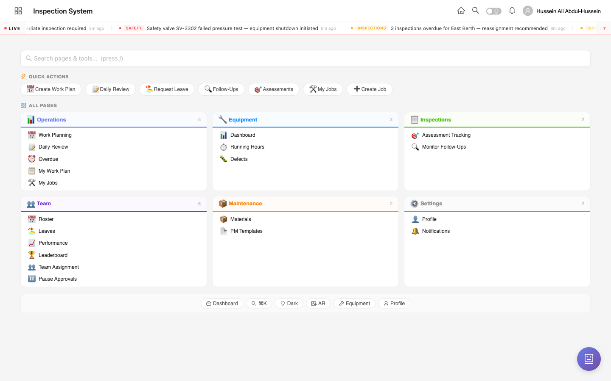
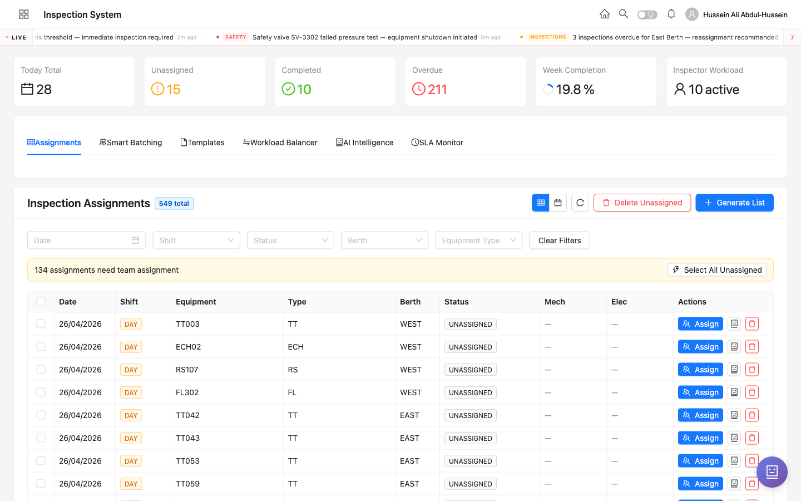
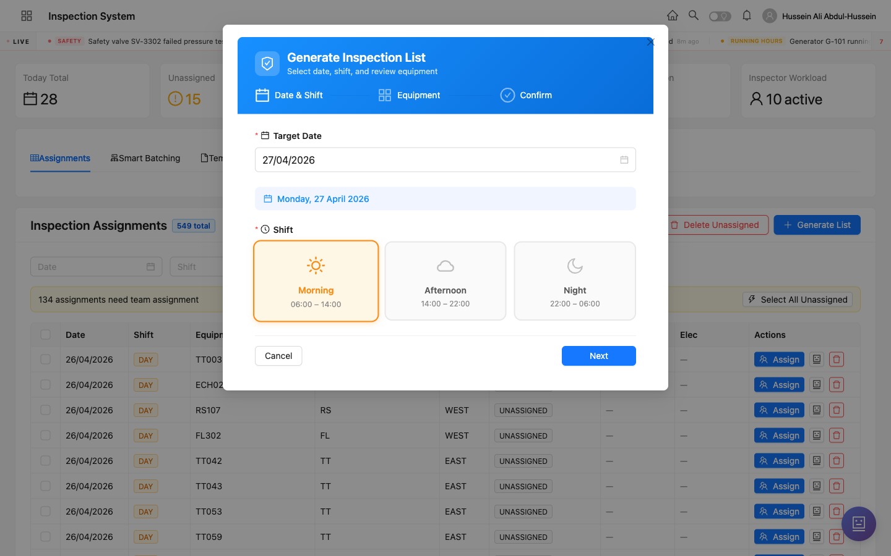
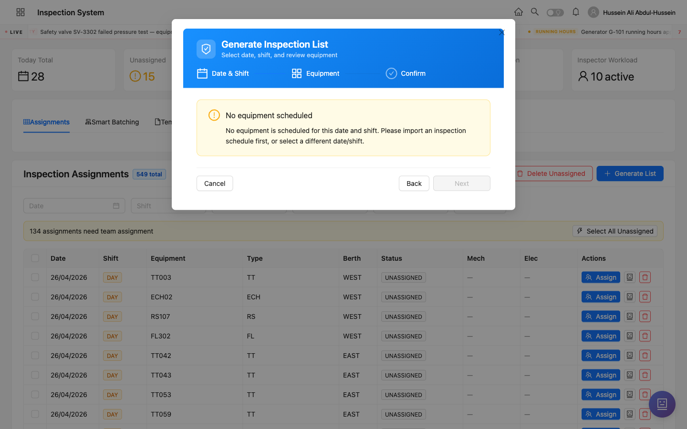

<div class="cover">
  <div>
    <div class="brand">Inspection System • Training</div>
    <div class="icon-pill">📋 Workflow 1 of 3</div>
    <div class="title">Generate an Inspection</div>
    <div class="subtitle">A step-by-step guide for engineers and admins to create the daily inspection list, from the Generate List wizard to where the inspections appear after submission.</div>
  </div>
  <div class="meta">
    <div><strong>Audience</strong> Engineer • Admin</div>
    <div><strong>Version</strong> 1.0 — 2026-04-26</div>
  </div>
</div>

# Generate an Inspection

## Who can do this

| Role | Generate inspection list | Fill the inspection | Review submitted inspection |
|------|:-:|:-:|:-:|
| <span class="role admin">Admin</span> | ✓ | — | ✓ |
| <span class="role engineer">Engineer</span> | ✓ | — | ✓ |
| <span class="role inspector">Inspector</span> | — | ✓ | — |
| <span class="role specialist">Specialist</span> | — | ✓ | — |
| <span class="role maintenance">Maintenance</span> | — | ✓ | — |

<div class="callout info"><strong>What this means</strong>Only engineers and admins create the daily list. Inspectors / specialists / maintenance staff fill the inspections from their <em>My Assignments</em> screen on the mobile app.</div>

## Before you start

Make sure these prerequisites are in place — if any one is missing, the wizard will show an empty state in step 2:

- **Equipment exists** in the system, with the `berth` field set (East / West).
- **An inspection schedule** is defined for that equipment for the date and shift you want to generate.
- **Inspection templates / checklist items** are configured for the equipment type.
- **Inspectors are registered** with their specialization (mechanical or electrical).

## Step-by-step

### 1. Sign in and open the dashboard

Sign in with your engineer credentials. The dashboard shows the main areas you can work with — Operations, Equipment, Inspections, Team, Maintenance, and Settings.



<div class="callout tip"><strong>Quick tip</strong>The <strong>Quick Actions</strong> row at the top includes shortcuts to the most-used screens. You'll use <em>Daily Review</em> a lot once inspections start being submitted.</div>

### 2. Open the Inspection Assignments page

From the **Inspections** card click any item, or navigate directly to the URL `/admin/assignments`. You'll see the assignments overview with stat tiles at the top and the full assignment table below.



The six stat tiles tell you the current state of inspection work:

| Stat | What it counts |
|------|---------------|
| **Today Total** | Inspections scheduled for today across all shifts |
| **Unassigned** | Generated inspections that don't yet have a team |
| **Completed** | Inspections submitted and accepted today |
| **Overdue** | Inspections past their due date |
| **Week Completion** | Percentage of this week's inspections completed |
| **Inspector Workload** | Number of inspectors currently active |

### 3. Click "Generate List"

Click the blue **+ Generate List** button (top-right of the table). A 3-step wizard opens.

<div class="step"><div class="num">1</div><div class="body"><strong>Date & Shift</strong> — choose the inspection date and the shift (Morning, Afternoon, or Night).</div></div>
<div class="step"><div class="num">2</div><div class="body"><strong>Equipment</strong> — review the equipment that will be added to the list (system-suggested based on your schedule).</div></div>
<div class="step"><div class="num">3</div><div class="body"><strong>Confirm</strong> — review and create the inspection assignments.</div></div>

### 4. Step 1 — Pick the date and shift

Tap the **Target Date** field, choose a date from the calendar, then click one of the three shift cards.



Shift hours:

| Shift | Hours |
|-------|-------|
| Morning | 06:00 – 14:00 |
| Afternoon | 14:00 – 22:00 |
| Night | 22:00 – 06:00 |

The **Next** button stays disabled until both Date and Shift are filled.

### 5. Step 2 — Review the equipment

When you click Next, the wizard reads the inspection schedule and lists the equipment due for inspection on that date and shift.



<div class="callout warn"><strong>If you see "No equipment scheduled"</strong>It means no schedule entry exists for that date and shift. Either pick a different date/shift, or add an inspection schedule first via the <em>Templates</em> tab.</div>

### 6. Step 3 — Confirm and generate

Click **Next** again to see the review summary — count of equipment, by berth, by type — then click **Generate List**.

The system creates one assignment per piece of equipment. Each assignment starts in the **Unassigned** status — you'll need to assign a 2-person team to each one (see the *Assign an Inspection* guide).

## What happens after

| Where | What you'll see |
|-------|----------------|
| `/admin/assignments` | The new assignments appear in the table with status **UNASSIGNED**. The "Today Total" stat increases. |
| Mobile app — *My Assignments* | Once you assign a team, the inspection appears under the assigned inspector's *My Assignments* tab. |
| `/admin/inspections` | Once submitted, the inspection moves to the All Inspections list for review. |

## Status lifecycle

```
unassigned → assigned → in_progress → mech_complete / elec_complete
                                         ↓
                                   both_complete → assessment_pending → completed
```

| Status | Meaning |
|--------|---------|
| `unassigned` | List generated, no team yet |
| `assigned` | Both inspectors picked, awaiting start |
| `in_progress` | First inspector started filling |
| `mech_complete` / `elec_complete` | One discipline finished |
| `both_complete` / `assessment_pending` | Both done, awaiting engineer verdict |
| `completed` | Engineer accepted the assessment |

## Troubleshooting

| Problem | Cause | Fix |
|---------|-------|-----|
| "No equipment scheduled" in step 2 | No schedule row for that date/shift | Pick a different date/shift, or add a schedule via *Templates* |
| Generate List button is missing | You're not logged in as admin or engineer | Ask your admin to grant you the role |
| Generated count is lower than expected | Some equipment is missing the `berth` field | Open the equipment record and set East or West |
| Wizard hangs on step 3 | Network timeout — backend call took too long | Cancel, refresh page, try again |

## Glossary

- **Assignment** — a single inspection slot for one piece of equipment on a specific date and shift, awaiting a team.
- **Berth** — physical location (East or West) where the equipment sits.
- **Shift** — Morning / Afternoon / Night work block.
- **Schedule** — the recurring rule that says "this equipment must be inspected this often".
- **Specialization** — Mechanical or Electrical, determining which inspector dropdown a person appears in.

<!--LANG_DIVIDER-->

<div class="cover">
  <div>
    <div class="brand">نظام التفتيش • التدريب</div>
    <div class="icon-pill">📋 سير العمل ١ من ٣</div>
    <div class="title" dir="rtl">إنشاء قائمة تفتيش</div>
    <div class="subtitle" dir="rtl">دليل خطوة بخطوة للمهندسين والمسؤولين لإنشاء قائمة التفتيش اليومية، بدءًا من معالج الإنشاء وحتى ظهور التفتيشات بعد تقديمها.</div>
  </div>
  <div class="meta">
    <div><strong>الجمهور</strong> مهندس • مسؤول</div>
    <div><strong>الإصدار</strong> ١٫٠ — ٢٠٢٦/٠٤/٢٦</div>
  </div>
</div>

# إنشاء قائمة تفتيش

## من يستطيع القيام بذلك

| الدور | إنشاء قائمة التفتيش | تعبئة التفتيش | مراجعة التفتيش المقدم |
|------|:-:|:-:|:-:|
| <span class="role admin">مسؤول</span> | ✓ | — | ✓ |
| <span class="role engineer">مهندس</span> | ✓ | — | ✓ |
| <span class="role inspector">مفتش</span> | — | ✓ | — |
| <span class="role specialist">أخصائي</span> | — | ✓ | — |
| <span class="role maintenance">صيانة</span> | — | ✓ | — |

<div class="callout info"><strong>ماذا يعني هذا</strong>المهندسون والمسؤولون فقط هم من ينشئون القائمة اليومية. أما المفتشون والأخصائيون وموظفو الصيانة، فيقومون بتعبئة التفتيشات من شاشة <em>تفتيشاتي</em> في تطبيق الجوال.</div>

## قبل البدء

تأكد من توفر هذه المتطلبات — إذا كان أحدها مفقودًا، سيُظهر المعالج حالة فارغة في الخطوة الثانية:

- **وجود المعدات** في النظام مع تحديد حقل `الرصيف` (شرقي / غربي).
- **وجود جدول تفتيش** محدد لهذه المعدة للتاريخ والوردية المطلوبة.
- **قوالب التفتيش / عناصر القائمة** معدة لنوع المعدة.
- **تسجيل المفتشين** مع تخصصهم (ميكانيكي أو كهربائي).

## الخطوات

### ١. تسجيل الدخول وفتح لوحة التحكم

سجّل الدخول باستخدام بيانات اعتماد المهندس. تُظهر لوحة التحكم المجالات الرئيسية التي يمكنك العمل عليها — العمليات، المعدات، التفتيشات، الفريق، الصيانة، والإعدادات.


<div class="callout tip"><strong>نصيحة سريعة</strong>صف <strong>الإجراءات السريعة</strong> في الأعلى يحتوي على اختصارات لأكثر الشاشات استخدامًا. ستستخدم <em>المراجعة اليومية</em> كثيرًا بعد بدء تقديم التفتيشات.</div>

### ٢. افتح صفحة تعيينات التفتيش

من بطاقة **التفتيشات** اضغط على أي عنصر، أو انتقل مباشرة إلى الرابط `/admin/assignments`. سترى نظرة عامة على التعيينات مع مربعات الإحصائيات في الأعلى وجدول التعيينات الكامل أدناه.


تخبرك مربعات الإحصائيات الستة بالحالة الحالية لأعمال التفتيش:

| الإحصائية | ما تحسبه |
|-----------|----------|
| **مجموع اليوم** | التفتيشات المجدولة لهذا اليوم في جميع الورديات |
| **غير مُعيَّن** | التفتيشات المُنشأة بدون فريق بعد |
| **مكتمل** | التفتيشات المُقدَّمة والمقبولة اليوم |
| **متأخر** | التفتيشات التي تجاوزت تاريخ الاستحقاق |
| **اكتمال الأسبوع** | نسبة تفتيشات هذا الأسبوع المكتملة |
| **عبء عمل المفتشين** | عدد المفتشين النشطين حاليًا |

### ٣. اضغط "إنشاء قائمة"

اضغط الزر الأزرق **+ إنشاء قائمة** (أعلى اليمين من الجدول). سيُفتح معالج من ٣ خطوات.

<div class="step"><div class="num">١</div><div class="body"><strong>التاريخ والوردية</strong> — اختر تاريخ التفتيش والوردية (صباحًا، ظهرًا، أو ليلًا).</div></div>
<div class="step"><div class="num">٢</div><div class="body"><strong>المعدات</strong> — راجع المعدات التي ستُضاف إلى القائمة (مقترحة من النظام بناءً على جدولك).</div></div>
<div class="step"><div class="num">٣</div><div class="body"><strong>التأكيد</strong> — راجع وأنشئ تعيينات التفتيش.</div></div>

### ٤. الخطوة ١ — اختر التاريخ والوردية

اضغط على حقل **التاريخ المستهدف**، اختر تاريخًا من التقويم، ثم اضغط على إحدى بطاقات الورديات الثلاث.


ساعات الورديات:

| الوردية | الساعات |
|---------|---------|
| صباحًا | ٠٦:٠٠ – ١٤:٠٠ |
| ظهرًا | ١٤:٠٠ – ٢٢:٠٠ |
| ليلًا | ٢٢:٠٠ – ٠٦:٠٠ |

يبقى زر **التالي** معطلًا حتى يتم تعبئة التاريخ والوردية معًا.

### ٥. الخطوة ٢ — راجع المعدات

عند الضغط على التالي، يقرأ المعالج جدول التفتيش ويعرض المعدات المستحقة للتفتيش في ذلك التاريخ والوردية.


<div class="callout warn"><strong>إذا رأيت "لا توجد معدات مجدولة"</strong>هذا يعني عدم وجود جدول للتاريخ والوردية المختارين. اختر تاريخًا/وردية مختلفة، أو أضف جدول تفتيش أولًا عبر تبويب <em>القوالب</em>.</div>

### ٦. الخطوة ٣ — أكِّد وأنشئ

اضغط **التالي** مرة أخرى لرؤية ملخص المراجعة — عدد المعدات، حسب الرصيف، حسب النوع — ثم اضغط **إنشاء قائمة**.

ينشئ النظام تعيينًا واحدًا لكل قطعة معدات. يبدأ كل تعيين بحالة **غير مُعيَّن** — ستحتاج إلى تعيين فريق مكوَّن من شخصين لكل واحد منها (راجع دليل *تعيين تفتيش*).

## ماذا يحدث بعد ذلك

| المكان | ما ستراه |
|--------|----------|
| `/admin/assignments` | تظهر التعيينات الجديدة في الجدول بحالة **غير مُعيَّن**. تزداد إحصائية "مجموع اليوم". |
| تطبيق الجوال — *تفتيشاتي* | بمجرد تعيين فريق، يظهر التفتيش تحت تبويب *تفتيشاتي* للمفتش المُعيَّن. |
| `/admin/inspections` | بمجرد التقديم، ينتقل التفتيش إلى قائمة جميع التفتيشات للمراجعة. |

## دورة حياة الحالة

```
غير مُعيَّن → مُعيَّن → قيد التنفيذ → ميكانيكي مكتمل / كهربائي مكتمل
                                           ↓
                                  كلاهما مكتمل → بانتظار التقييم → مكتمل
```

## استكشاف الأخطاء

| المشكلة | السبب | الحل |
|---------|------|------|
| "لا توجد معدات مجدولة" في الخطوة ٢ | لا يوجد جدول لذلك التاريخ/الوردية | اختر تاريخًا/وردية مختلفة، أو أضف جدولًا عبر *القوالب* |
| زر إنشاء قائمة مفقود | لست مسجلًا كمسؤول أو مهندس | اطلب من المسؤول منحك الدور |
| العدد المُولَّد أقل من المتوقع | بعض المعدات تفتقر إلى حقل `الرصيف` | افتح سجل المعدة وحدد شرقي أو غربي |
| المعالج معلَّق في الخطوة ٣ | انتهت مهلة الشبكة — استغرق الاتصال بالخادم وقتًا طويلًا | إلغاء، تحديث الصفحة، إعادة المحاولة |
