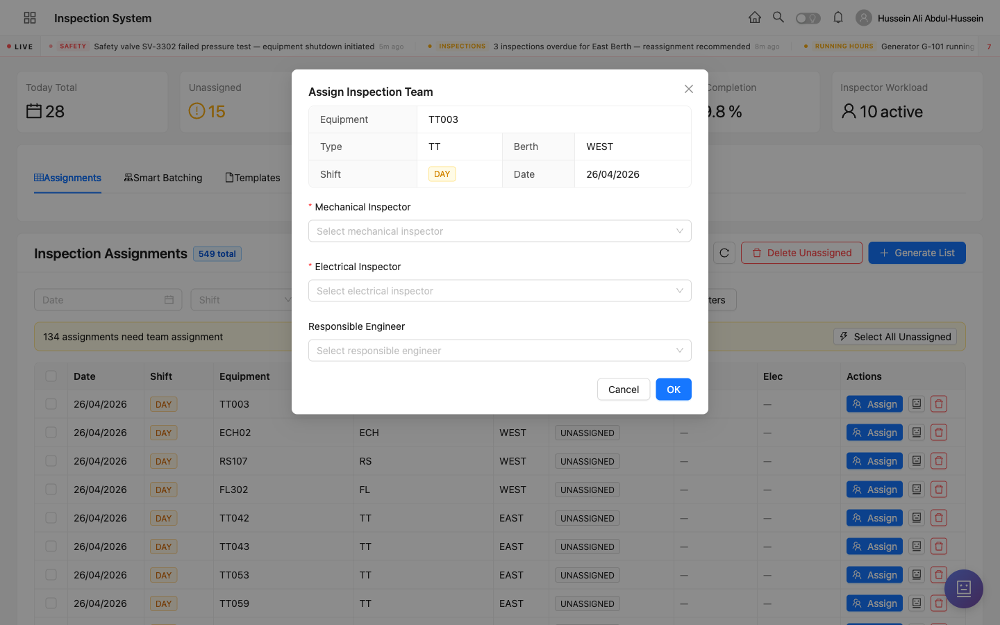
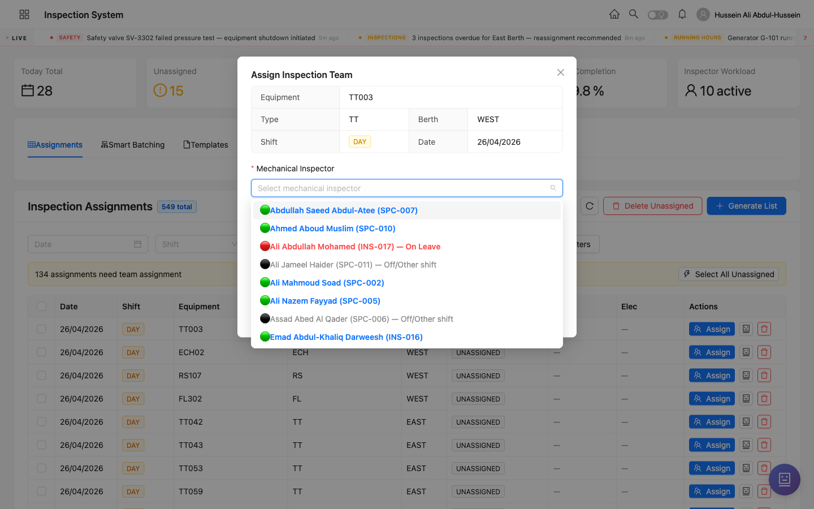

<div class="cover">
  <div>
    <div class="brand">Inspection System • Training</div>
    <div class="icon-pill">👥 Workflow 2 of 3</div>
    <div class="title">Assign an Inspection</div>
    <div class="subtitle">How to pick a 2-person team — one mechanical and one electrical inspector — for a generated inspection assignment, with shift-aware availability checks.</div>
  </div>
  <div class="meta">
    <div><strong>Audience</strong> Engineer • Admin</div>
    <div><strong>Version</strong> 1.0 — 2026-04-26</div>
  </div>
</div>

# Assign an Inspection

## Who can do this

| Role | Assign team | Reassign team | Unassign | Bulk assign |
|------|:-:|:-:|:-:|:-:|
| <span class="role admin">Admin</span> | ✓ | ✓ | ✓ | ✓ |
| <span class="role engineer">Engineer</span> | ✓ | ✓ | ✓ | ✓ |
| <span class="role inspector">Inspector</span> | — | — | — | — |
| <span class="role specialist">Specialist</span> | — | — | — | — |
| <span class="role maintenance">Maintenance</span> | — | — | — | — |

<div class="callout info"><strong>Required team composition</strong>Every inspection assignment needs <strong>two inspectors</strong>: one with <em>Mechanical</em> specialization and one with <em>Electrical</em>. The Responsible Engineer is optional — assign one when the inspection requires engineering oversight.</div>

## Before you start

- **The assignment must already exist** — generated via the *Generate List* wizard (see Workflow 1).
- **Inspectors are registered** with role = `inspector` and a specialization = `mechanical` or `electrical`.
- **Inspectors are on shift** — the system marks people on leave or off-shift in the dropdowns so you can avoid them.

## Step-by-step

### 1. Open the Inspection Assignments page

Sign in and navigate to `/admin/assignments`. You'll see the assignment table with its UNASSIGNED rows.


The yellow banner at the top — *"134 assignments need team assignment"* — gives you a quick count and a **Select All Unassigned** button if you want to bulk-assign multiple at once.

### 2. Click "Assign" on the row you want to staff

Click the blue **Assign** button on the right side of any UNASSIGNED row. The *Assign Inspection Team* modal opens with the equipment details pre-filled at the top.



The modal shows you the inspection context:

| Field | Example |
|-------|---------|
| Equipment | TT003 |
| Type | TT |
| Berth | WEST |
| Shift | DAY |
| Date | 26/04/2026 |

### 3. Pick the Mechanical Inspector

Click the **Mechanical Inspector** dropdown. The list shows every inspector with mechanical specialization, **color-coded by shift availability**:



| Color | Meaning | Can you pick them? |
|-------|---------|:-:|
| 🟢 Green | Available on this shift | ✓ Yes |
| 🔴 Red | On leave | Avoid — they're off |
| ⚫ Grey | Off-shift / other shift | Avoid — pick a same-shift inspector |

<div class="callout tip"><strong>Use the search box</strong>You can type a name or employee code (e.g. <code>SPC-007</code>, <code>INS-016</code>) directly into the dropdown to filter the list.</div>

### 4. Pick the Electrical Inspector

Repeat the same steps for the **Electrical Inspector** dropdown. The same color rules apply.

### 5. (Optional) Pick a Responsible Engineer

If this inspection needs an engineer to be accountable, pick one from the **Responsible Engineer** dropdown. Leave blank otherwise.

### 6. Click "OK" to confirm

The system validates the team composition (mechanical + electrical, both same shift), saves the assignment, and closes the modal. The row's status changes from **UNASSIGNED** to **ASSIGNED** and the inspector names appear in the Mech / Elec columns.

## What happens after

| Where | What changes |
|-------|--------------|
| Assignments table | Status = **ASSIGNED**, Mech and Elec columns now show inspector names. |
| Mobile app — *My Assignments* (assigned inspector) | The inspection appears in their *Pending* tab. They'll see a notification. |
| Stat tile *Unassigned* | Decreases by 1. |
| Smart Batching tab | If the equipment shares a berth with other unassigned items, the system may auto-suggest the same team for the others. |

## Status lifecycle reminder

```
unassigned → assigned → in_progress → mech_complete + elec_complete
                                              ↓
                                       assessment_pending → completed
```

You're moving the assignment from `unassigned` to `assigned` in this workflow.

## Bulk assign

For dense weeks, click **Select All Unassigned** in the yellow banner, then use the **AI Suggest** option in the page header — it recommends the best mechanical/electrical pair for each row based on:

- shift availability,
- past performance per equipment type,
- current workload balance across the inspector pool.

You can accept the AI's suggestions all at once or override individual rows.

## Troubleshooting

| Problem | Cause | Fix |
|---------|-------|-----|
| OK button stays grey | Either mechanical or electrical not selected | Both dropdowns are required; pick one each |
| Inspector you want isn't in the list | They have the wrong specialization, or they're off-shift | Check their profile in *Team → Roster*; change spec if needed |
| Inspector marked **On Leave** | They have an approved leave for this date | Check *Team → Leaves* — wait until they return, or pick someone else |
| All inspectors are grey (off-shift) | The shift on this assignment doesn't match any active inspector's roster | Adjust the roster in *Team → Roster*, or pick a different date/shift first |
| AI Suggest gives weird picks | Past performance data is sparse for this equipment type | Override manually; the AI improves as more inspections complete |

## Glossary

- **Assigned inspector** — the inspector who will physically perform the inspection on-site.
- **Responsible Engineer** — optional engineer accountable for the assignment's completion (separate from the team).
- **Specialization** — Mechanical or Electrical. Each inspection needs one of each.
- **Shift availability** — derived from the team Roster (which inspector works which shift).
- **AI Suggest** — automated team recommendation based on past performance + current load.

<!--LANG_DIVIDER-->

<div class="cover">
  <div>
    <div class="brand">نظام التفتيش • التدريب</div>
    <div class="icon-pill">👥 سير العمل ٢ من ٣</div>
    <div class="title" dir="rtl">تعيين تفتيش</div>
    <div class="subtitle" dir="rtl">كيفية اختيار فريق من شخصين — مفتش ميكانيكي وآخر كهربائي — لتعيين تفتيش مُولَّد، مع التحقق من توفر الورديات.</div>
  </div>
  <div class="meta">
    <div><strong>الجمهور</strong> مهندس • مسؤول</div>
    <div><strong>الإصدار</strong> ١٫٠ — ٢٠٢٦/٠٤/٢٦</div>
  </div>
</div>

# تعيين تفتيش

## من يستطيع القيام بذلك

| الدور | تعيين فريق | إعادة تعيين | إلغاء التعيين | التعيين الجماعي |
|------|:-:|:-:|:-:|:-:|
| <span class="role admin">مسؤول</span> | ✓ | ✓ | ✓ | ✓ |
| <span class="role engineer">مهندس</span> | ✓ | ✓ | ✓ | ✓ |
| <span class="role inspector">مفتش</span> | — | — | — | — |
| <span class="role specialist">أخصائي</span> | — | — | — | — |
| <span class="role maintenance">صيانة</span> | — | — | — | — |

<div class="callout info"><strong>تركيبة الفريق المطلوبة</strong>كل تعيين تفتيش يحتاج إلى <strong>مفتشين اثنين</strong>: واحد بتخصص <em>ميكانيكي</em> وآخر بتخصص <em>كهربائي</em>. أما المهندس المسؤول فهو اختياري — عيِّن واحدًا عندما يتطلب التفتيش إشرافًا هندسيًا.</div>

## قبل البدء

- **يجب أن يكون التعيين موجودًا بالفعل** — مُولَّدًا عبر معالج *إنشاء قائمة* (راجع سير العمل ١).
- **المفتشون مسجَّلون** بدور `مفتش` وتخصص = `ميكانيكي` أو `كهربائي`.
- **المفتشون في الوردية** — يضع النظام علامة على الأشخاص في الإجازة أو خارج الوردية في القوائم المنسدلة لتجنبهم.

## الخطوات

### ١. افتح صفحة تعيينات التفتيش

سجِّل الدخول وانتقل إلى `/admin/assignments`. سترى جدول التعيينات مع الصفوف غير المُعيَّنة.


اللافتة الصفراء في الأعلى — *"١٣٤ تعيينًا بحاجة إلى تعيين فريق"* — تعطيك عدًا سريعًا وزر **اختيار الكل غير المُعيَّن** للتعيين الجماعي.

### ٢. اضغط "تعيين" على الصف الذي تريد تجهيزه

اضغط الزر الأزرق **تعيين** على يمين أي صف غير مُعيَّن. تُفتح نافذة *تعيين فريق التفتيش* مع تفاصيل المعدة معبأة مسبقًا في الأعلى.


### ٣. اختر المفتش الميكانيكي

اضغط على القائمة المنسدلة **المفتش الميكانيكي**. تعرض القائمة كل مفتش بتخصص ميكانيكي، **ملوَّنًا حسب توفر الوردية**:


| اللون | المعنى | هل يمكن اختياره؟ |
|------|--------|:-:|
| 🟢 أخضر | متاح في هذه الوردية | ✓ نعم |
| 🔴 أحمر | في إجازة | تجنبه — هو خارج العمل |
| ⚫ رمادي | خارج الوردية / وردية أخرى | تجنبه — اختر مفتشًا في نفس الوردية |

<div class="callout tip"><strong>استخدم مربع البحث</strong>يمكنك كتابة اسم أو رمز موظف (مثل <code>SPC-007</code> أو <code>INS-016</code>) مباشرة في القائمة المنسدلة لتصفية القائمة.</div>

### ٤. اختر المفتش الكهربائي

كرر نفس الخطوات للقائمة المنسدلة **المفتش الكهربائي**. تنطبق نفس قواعد الألوان.

### ٥. (اختياري) اختر مهندسًا مسؤولًا

إذا احتاج هذا التفتيش إلى مهندس مسؤول، اختر واحدًا من قائمة **المهندس المسؤول**. اتركها فارغة بخلاف ذلك.

### ٦. اضغط "موافق" للتأكيد

يتحقق النظام من تركيبة الفريق (ميكانيكي + كهربائي، كلاهما في نفس الوردية)، ويحفظ التعيين، ويغلق النافذة. تتغير حالة الصف من **غير مُعيَّن** إلى **مُعيَّن** وتظهر أسماء المفتشين في عمودي ميكا/كهر.

## ماذا يحدث بعد ذلك

| المكان | ما يتغير |
|--------|----------|
| جدول التعيينات | الحالة = **مُعيَّن**، عمودا ميكا وكهر يعرضان الآن أسماء المفتشين. |
| تطبيق الجوال — *تفتيشاتي* (المفتش المُعيَّن) | يظهر التفتيش في تبويب *قيد الانتظار* لديه. سيرى إشعارًا. |
| مربع الإحصائية *غير مُعيَّن* | يقل بمقدار ١. |
| تبويب التجميع الذكي | إذا كانت المعدة تشترك في رصيف مع عناصر أخرى غير مُعيَّنة، قد يقترح النظام تلقائيًا نفس الفريق للأخريات. |

## استكشاف الأخطاء

| المشكلة | السبب | الحل |
|---------|------|------|
| زر موافق يبقى رماديًا | لم يتم اختيار الميكانيكي أو الكهربائي | كلا القائمتين مطلوبتان؛ اختر واحدًا من كل منهما |
| المفتش الذي تريده غير موجود في القائمة | لديه تخصص خاطئ، أو خارج الوردية | تحقق من ملفه في *الفريق ← الجدول*؛ غيِّر التخصص إذا لزم الأمر |
| المفتش مُعلَّم بـ **في إجازة** | لديه إجازة معتمدة لهذا التاريخ | تحقق من *الفريق ← الإجازات* — انتظر عودته أو اختر شخصًا آخر |
| كل المفتشين رماديون (خارج الوردية) | الوردية في هذا التعيين لا تتطابق مع جدول أي مفتش نشط | عدِّل الجدول في *الفريق ← الجدول*، أو اختر تاريخًا/وردية مختلفة أولًا |
