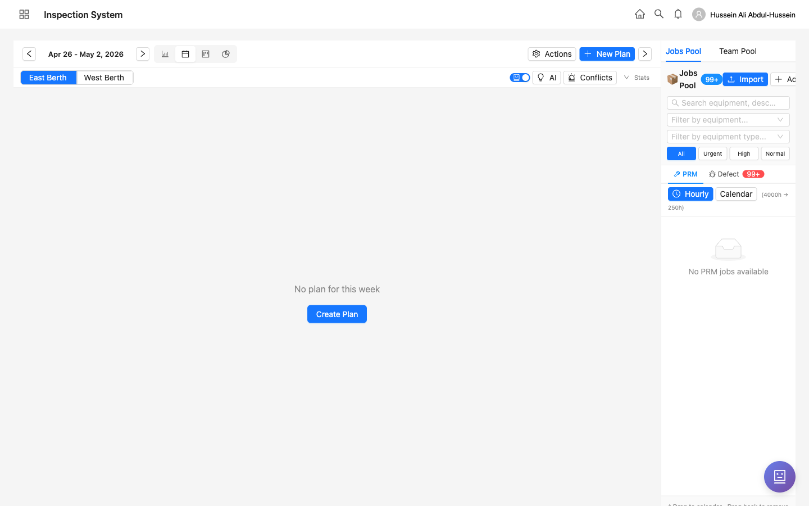
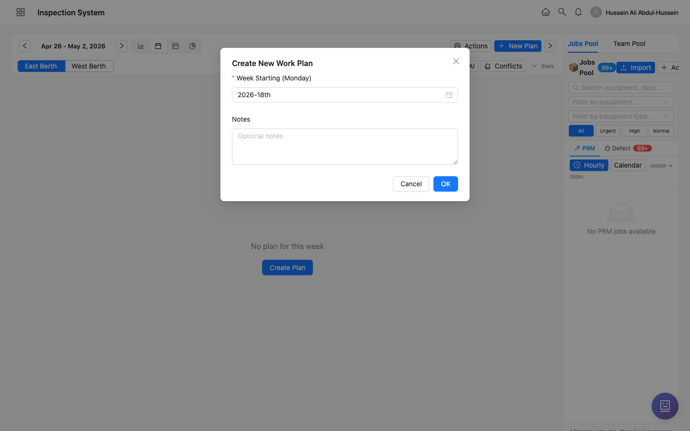
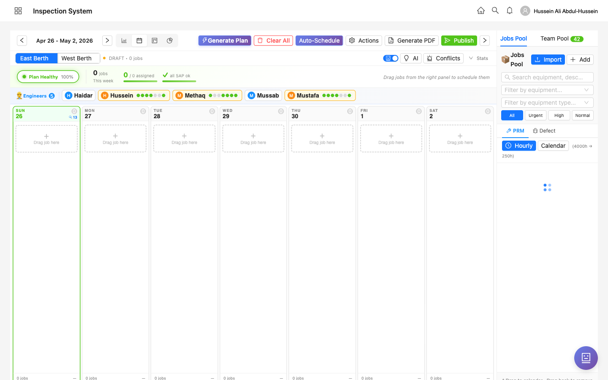
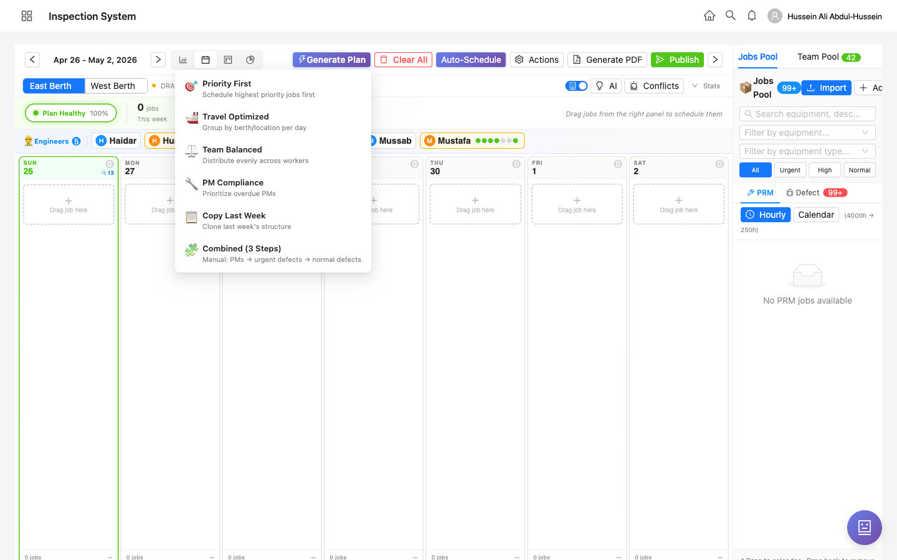
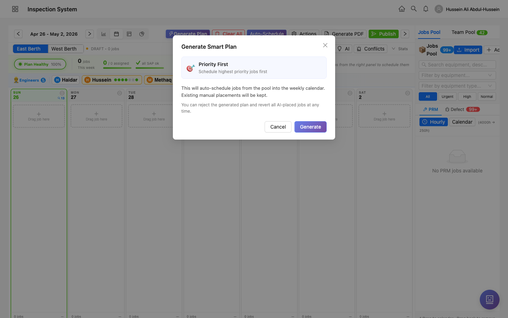
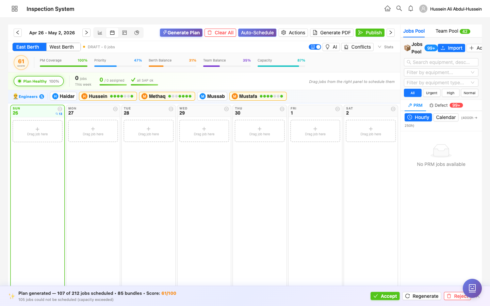
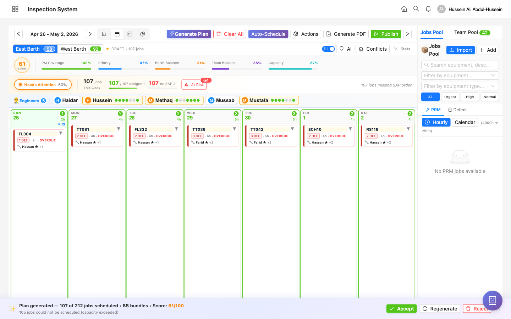

  

    
Inspection System • Training

    
📅 Workflow 3 of 3

    
Create a Work Plan

    
Generate a smart weekly work plan in one click using one of six recipes — Priority First, Travel Optimized, Team Balanced, PM Compliance, Copy Last Week, or Combined.

  

  

    
<strong>Audience</strong> Engineer • Admin

    
<strong>Version</strong> 1.0 — 2026-04-26

  

# Create a Work Plan

## Who can do this

| Role | Create plan | Generate (AI) | Accept / Reject | Publish | Mark job complete |
|------|:-:|:-:|:-:|:-:|:-:|
| Admin | ✓ | ✓ | ✓ | ✓ | ✓ |
| Engineer | ✓ | ✓ | ✓ | ✓ | ✓ |
| Inspector | — | — | — | — | View only |
| Specialist | — | — | — | — | View only |
| Maintenance | — | — | — | — | Own jobs only |

<strong>What a work plan is</strong>A weekly schedule of jobs (PM tasks, defect fixes, equipment readings) distributed across days and team members. Each plan covers Mon–Sun and lives in <em>draft</em> state until you click <strong>Publish</strong>.

## Before you start

- **Jobs must exist in the pool** — PMs from schedules, defects from inspections, or imported SAP orders.
- **The team is on the roster for the week** — engineers and specialists you want assigned must show up under *Engineers* / *Maintenance*.
- **(Optional) Capacity configs** — used by the scoring engine to balance berth and team load.

## Step-by-step

### 1. Open the Work Planning page

Sign in and navigate to **Operations → Work Planning** (or `/admin/work-planning`).

If no plan exists for the current week, you'll see the empty state with a single **Create Plan** button:

The toolbar across the top includes:

| Control | Purpose |
|---------|---------|
| ◄ Apr 26 - May 2, 2026 ► | Week selector — jump to any week |
| 📊 Chart icon | Switch to score breakdown view |
| 📅 Calendar icon | Switch to calendar view |
| 🟦 Gantt icon | Switch to Gantt timeline |
| ⏰ Clock icon | Switch to hourly view |
| **+ New Plan** | Create a draft plan for the selected week |

### 2. Click "+ New Plan"

A small dialog asks for the **Week Starting (Monday)** date and an optional **Notes** field. The week defaults to the one you have open.

Click **OK** to create the empty draft.

### 3. Empty draft — choose how to populate it

The plan opens in DRAFT state with a 7-day timeline (Sun–Sat) and the team listed across the top. All day cells are empty:

You have three ways to fill it:

A

<strong>Drag & drop</strong> — drag jobs from the right-hand <em>Jobs Pool</em> into specific day cells. Useful for small adjustments or fully manual planning.

B

<strong>Generate Plan</strong> — pick a recipe (one of six) and let the system place jobs automatically. <strong>This is the recommended path</strong>.

C

<strong>Auto-Schedule</strong> — uses your last-used recipe with default options.

### 4. Click "Generate Plan" and pick a recipe

Click the purple **Generate Plan** button in the toolbar. A dropdown shows six recipes, each with a short description:

| Recipe | Best for |
|--------|---------|
| **Priority First** | Catching up — schedule highest-priority jobs first |
| **Travel Optimized** | Saving travel time — group jobs by berth/location per day |
| **Team Balanced** | Even load — distribute jobs evenly across workers |
| **PM Compliance** | Audit / overdue PM cleanup — prioritize overdue preventive maintenance |
| **Copy Last Week** | Recurring weeks — clone last week's structure |
| **Combined (3 Steps)** | Manual control — run PMs → urgent defects → normal defects, accepting between each |

### 5. Confirm and generate

Pick a recipe (e.g. **Priority First**). A confirmation dialog explains what will happen:

<strong>"Existing manual placements will be kept"</strong>If you've already dragged some jobs in manually, the recipe respects them. The AI fills in the rest.

Click **Generate**. The system runs for a few seconds and lands you back on the timeline.

### 6. Review the generated plan

The bottom of the page now shows a **Generation Action Bar** with:

- ✨ Plan summary: *"Plan generated — 107 of 212 jobs scheduled • 85 bundles • Score: 61/100"*
- ⚠️ Warning if any jobs couldn't be scheduled (capacity exceeded)
- ✓ **Accept** (green) — keep the AI placements
- 🔁 **Regenerate** — try the recipe again with different randomness
- ✗ **Reject** (red) — wipe AI placements, return to whatever you had before

The top of the page shows the **score breakdown**:

| Metric | What it measures |
|--------|------------------|
| **PM Coverage** | % of due PMs that got scheduled |
| **Priority** | Whether higher-priority jobs landed earlier in the week |
| **Berth Balance** | Even spread of work between East and West berth |
| **Team Balance** | Even workload across team members |
| **Capacity** | Total scheduled hours vs. total team capacity |

### 7. Browse the schedule

Click **East Berth** or **West Berth** to switch berth. Each day card shows the jobs allocated to that day — equipment code, defect count, hours, and who's assigned.

The summary row above the timeline shows:

- **107 jobs / 107 assigned** — every scheduled job has an owner
- **107 no SAP #** — jobs missing SAP order numbers (will need them before publishing)
- **64 At Risk** — jobs flagged as high-risk for not completing on time

### 8. Accept and Publish

Once you're happy:

1. Click **Accept** in the action bar to lock in the AI placements.
2. Resolve any blocking issues (missing SAP numbers, conflicts).
3. Click the green **Publish** button (top-right).

Once published, the plan becomes visible to the assigned team in their **My Work Plan** screens (web + mobile), and the jobs appear in their daily To-Do.

### 9. Mark a job as complete (admin shortcut)

Once jobs are being executed, the normal flow is for the worker to mark their own job complete from the mobile app's **Job Execution** screen. As an engineer/admin, you have a shortcut:

- Open the published plan
- Click any job card to open its **details modal**
- Click the **Mark Complete** button

This bypasses the worker's start/pause/complete flow and is useful when:

- The worker forgot to mark it
- The job was completed by someone else
- You're cleaning up after a no-show

Auto-side-effect: any defect linked to that job is automatically resolved when the job is marked complete.

## What happens after publish

| Where | What you'll see |
|-------|----------------|
| Work Planning page | Status changes from DRAFT to PUBLISHED. Banner appears at the top. |
| Mobile — *My Work Plan* | Each team member sees their assigned jobs for the week. |
| Mobile — *My Jobs* | The day's jobs appear as a to-do list. |
| Daily Review | The day's progress is visible to engineers for end-of-day review. |

## Troubleshooting

| Problem | Cause | Fix |
|---------|-------|-----|
| "No PRM jobs available" in Jobs Pool | All PM jobs already scheduled, or no schedules defined | Run **PM Compliance** recipe — it'll be a no-op but confirms there's nothing due |
| Score is below 50 | Capacity is over-committed or jobs are unbalanced | Run **Team Balanced** recipe; or remove low-priority jobs |
| Some jobs say "could not be scheduled" | Total job hours exceed team capacity for the week | Either extend the team's roster, defer some jobs, or run **Priority First** to keep the most important ones |
| Publish button is greyed out | Plan has unresolved conflicts (e.g. same person double-booked) | Check the **Conflicts** tab, fix conflicts, retry |
| Combined (3 Steps) recipe is confusing | It's an interactive recipe — runs PMs → urgent → normal in 3 separate steps | Click each step in order, accept after each, then publish |

## Glossary

- **Recipe** — an algorithm that decides how to place jobs (Priority First, Travel Optimized, etc.).
- **Score** — overall quality of the plan (0–100), computed from PM coverage, priority, berth balance, team balance, capacity.
- **Bundle** — group of related jobs scheduled together (e.g. all jobs at the same berth on the same day).
- **DRAFT vs PUBLISHED** — DRAFT is editable and invisible to the team; PUBLISHED locks the plan and pushes it out to mobile.
- **Mark Complete (admin)** — engineer/admin shortcut to mark a job done without the worker's start/pause/complete flow.
- **Generation Action Bar** — the bottom bar that appears after generation with Accept/Regenerate/Reject buttons.

<!--LANG_DIVIDER-->

  

    
نظام التفتيش • التدريب

    
📅 سير العمل ٣ من ٣

    
إنشاء خطة عمل

    
إنشاء خطة عمل أسبوعية ذكية بضغطة واحدة باستخدام إحدى ست وصفات — الأولوية أولًا، تحسين السفر، توازن الفريق، الامتثال للصيانة الوقائية، نسخ الأسبوع الماضي، أو مدمج.

  

  

    
<strong>الجمهور</strong> مهندس • مسؤول

    
<strong>الإصدار</strong> ١٫٠ — ٢٠٢٦/٠٤/٢٦

  

# إنشاء خطة عمل

## من يستطيع القيام بذلك

| الدور | إنشاء الخطة | إنشاء بالذكاء الاصطناعي | قبول / رفض | نشر | إكمال مهمة |
|------|:-:|:-:|:-:|:-:|:-:|
| مسؤول | ✓ | ✓ | ✓ | ✓ | ✓ |
| مهندس | ✓ | ✓ | ✓ | ✓ | ✓ |
| مفتش | — | — | — | — | عرض فقط |
| أخصائي | — | — | — | — | عرض فقط |
| صيانة | — | — | — | — | مهامه فقط |

<strong>ما هي خطة العمل</strong>جدول أسبوعي للمهام (مهام الصيانة الوقائية، إصلاح الأعطال، قراءات المعدات) موزَّعة على الأيام وأعضاء الفريق. تغطي كل خطة من الإثنين إلى الأحد وتبقى في حالة <em>مسودة</em> حتى تضغط <strong>نشر</strong>.

## قبل البدء

- **يجب أن توجد المهام في المخزون** — مهام الصيانة الوقائية من الجداول، أعطال من التفتيشات، أو طلبات SAP المستوردة.
- **الفريق مدرج في الجدول للأسبوع** — المهندسون والأخصائيون الذين تريد تعيينهم يجب أن يظهروا تحت *المهندسون* / *الصيانة*.
- **(اختياري) إعدادات السعة** — يستخدمها محرك التسجيل لموازنة حمل الرصيف والفريق.

## الخطوات

### ١. افتح صفحة تخطيط العمل

سجِّل الدخول وانتقل إلى **العمليات ← تخطيط العمل** (أو `/admin/work-planning`).

إذا لم توجد خطة للأسبوع الحالي، سترى الحالة الفارغة مع زر **إنشاء خطة** الوحيد:

### ٢. اضغط "+ خطة جديدة"

يطلب منك حوار صغير تاريخ **بداية الأسبوع (الإثنين)** وحقل **ملاحظات** اختياري.

اضغط **موافق** لإنشاء المسودة الفارغة.

### ٣. مسودة فارغة — اختر كيفية تعبئتها

تُفتح الخطة في حالة المسودة مع جدول زمني لـ ٧ أيام (الأحد-السبت) والفريق مدرج في الأعلى. كل خلايا الأيام فارغة:

لديك ثلاث طرق لملئها:

A

<strong>السحب والإفلات</strong> — اسحب المهام من <em>مخزون المهام</em> على اليمين إلى خلايا أيام محددة. مفيد للتعديلات الصغيرة أو التخطيط اليدوي بالكامل.

B

<strong>إنشاء خطة</strong> — اختر وصفة (واحدة من ست) ودع النظام يضع المهام تلقائيًا. <strong>هذا هو المسار الموصى به</strong>.

C

<strong>الجدولة التلقائية</strong> — يستخدم آخر وصفة استخدمتها مع الخيارات الافتراضية.

### ٤. اضغط "إنشاء خطة" واختر وصفة

اضغط الزر البنفسجي **إنشاء خطة** في شريط الأدوات. تُظهر القائمة المنسدلة ست وصفات، كل واحدة مع وصف قصير:

| الوصفة | الأفضل لـ |
|--------|-----------|
| **الأولوية أولًا** | اللحاق بالمتأخر — جدولة المهام ذات الأولوية القصوى أولًا |
| **تحسين السفر** | توفير وقت السفر — تجميع المهام حسب الرصيف/الموقع لكل يوم |
| **توازن الفريق** | حمل متساوٍ — توزيع المهام بالتساوي على العاملين |
| **الامتثال للصيانة الوقائية** | تنظيف PM المتأخرة — إعطاء الأولوية للصيانة الوقائية المتأخرة |
| **نسخ الأسبوع الماضي** | الأسابيع المتكررة — استنساخ هيكل الأسبوع الماضي |
| **مدمج (٣ خطوات)** | تحكم يدوي — تشغيل PMs ← أعطال عاجلة ← أعطال عادية، مع القبول بين كل خطوة |

### ٥. أكِّد وأنشئ

اختر وصفة (مثل **الأولوية أولًا**). يشرح حوار التأكيد ما سيحدث:

<strong>"سيتم الاحتفاظ بالتعيينات اليدوية الموجودة"</strong>إذا كنت قد سحبت بعض المهام يدويًا، تحترمها الوصفة. يقوم الذكاء الاصطناعي بملء الباقي.

اضغط **إنشاء**. يعمل النظام لبضع ثوانٍ ويعيدك إلى الجدول الزمني.

### ٦. راجع الخطة المُولَّدة

يعرض الجزء السفلي من الصفحة الآن **شريط إجراء الإنشاء** مع:

- ✨ ملخص الخطة: *"تم إنشاء الخطة — ١٠٧ من ٢١٢ مهمة مجدولة • ٨٥ حزمة • النتيجة: ٦١/١٠٠"*
- ⚠️ تحذير إذا تعذر جدولة بعض المهام (تجاوزت السعة)
- ✓ **قبول** (أخضر) — احتفظ بتعيينات الذكاء الاصطناعي
- 🔁 **إعادة الإنشاء** — جرِّب الوصفة مرة أخرى بعشوائية مختلفة
- ✗ **رفض** (أحمر) — امسح تعيينات الذكاء الاصطناعي، عُد إلى ما كان لديك من قبل

### ٧. تصفَّح الجدول

اضغط **الرصيف الشرقي** أو **الرصيف الغربي** للتبديل بين الأرصفة. تعرض كل بطاقة يوم المهام المخصصة لذلك اليوم — رمز المعدة، عدد الأعطال، الساعات، ومن المُعيَّن.

### ٨. القبول والنشر

عندما تكون راضيًا:

1. اضغط **قبول** في شريط الإجراء لقفل تعيينات الذكاء الاصطناعي.
2. حلّ أي مشاكل تعطيلية (أرقام SAP المفقودة، التعارضات).
3. اضغط الزر الأخضر **نشر** (أعلى اليمين).

بمجرد النشر، تصبح الخطة مرئية للفريق المُعيَّن في شاشات **خطة عملي** (الويب + الجوال)، وتظهر المهام في قائمة مهامهم اليومية.

### ٩. وضع علامة على مهمة كمكتملة (اختصار للمسؤول)

بمجرد بدء تنفيذ المهام، يقوم العامل عادة بوضع علامة على مهمته كمكتملة من شاشة **تنفيذ المهمة** في تطبيق الجوال. كمهندس/مسؤول، لديك اختصار:

- افتح الخطة المنشورة
- اضغط على أي بطاقة مهمة لفتح **نافذة تفاصيلها**
- اضغط زر **وضع علامة كمكتمل**

يتجاوز هذا تدفق البدء/الإيقاف المؤقت/الإكمال للعامل وهو مفيد عندما:

- نسي العامل وضع العلامة
- اكتمل العمل من قبل شخص آخر
- أنت تنظف بعد عدم حضور

أثر تلقائي: يتم حل أي عطل مرتبط بهذه المهمة تلقائيًا عند وضع علامة المهمة كمكتملة.

## استكشاف الأخطاء

| المشكلة | السبب | الحل |
|---------|------|------|
| "لا توجد مهام PRM متاحة" في مخزون المهام | كل مهام الصيانة الوقائية مجدولة بالفعل، أو لم تُعرَّف جداول | شغِّل وصفة **الامتثال للصيانة الوقائية** — ستكون بدون عمل ولكنها تؤكد عدم وجود شيء مستحق |
| النتيجة أقل من ٥٠ | السعة مفرطة في الالتزام أو المهام غير متوازنة | شغِّل وصفة **توازن الفريق**؛ أو احذف المهام منخفضة الأولوية |
| بعض المهام تقول "تعذر جدولتها" | إجمالي ساعات المهام يتجاوز سعة الفريق للأسبوع | إما مدّد جدول الفريق، أو أجِّل بعض المهام، أو شغِّل **الأولوية أولًا** للاحتفاظ بالأهم |
| زر النشر معطَّل (رمادي) | الخطة تحتوي على تعارضات غير محلولة (مثل حجز نفس الشخص مرتين) | تحقق من تبويب **التعارضات**، حلّ التعارضات، أعد المحاولة |
